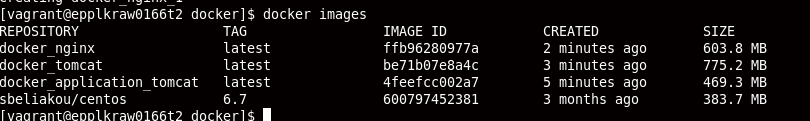

MTN.*NIX.11 Automated Environment Configuration Management
---

***Student***: [Yauhen Mihura](https://upsa.epam.com/workload/employeeView.do?employeeId=4060741400038707325#emplTab=general)

Home Task
---

Using base docker image ***sbeliakou/centos:6.7***

1. Wiht ```Dockerfiles```:
    - Create Docker Image of ```nginx``` ([web.Dockerfile](/web.Dockerfile))
    - Create Docker Image of ```Tomcat 7``` ([tomcat.Dockerfile](/tomcat.Dockerfile))
    - Create Docker Image (Data Volume) with [```hello world```](https://tomcat.apache.org/tomcat-7.0-doc/appdev/sample/sample.war) application for Tomcat ([application.Dockerfile](application.Dockerfile))
    - Run these Images so that [http://localhost/sample](#yakor) shows ```hello world``` page
    - ```Nginx``` container forwards http requests to ```Tomcat``` container; Only ```nginx``` container exposes port (80)
2. With ```docker-compose```:
    - Create [docker-compose.yml](/docker-compose.yml) file to build containers from previos task
    - Run "environment" in daemon mode
3. Create own branch (epam login without @epam.com, in lowercase)
4. Create PR with description of reported task
5. All needed changes (additional configuration/installations) on "Host" must be added into [Vagrantfile](/Vagrantfile)
6. All needed resources (if they are) must be placed into ```/resources``` folder

Task Report Notes
---
*All stuff must be provided in this section

<h2>To run Docker you must use next commands:</h2>
<h4>Two ways:</h4>
1) <b>vagrant up</b> (using docker-compose.yml)
<br>or<br>
2) Using dockerfiles:
* Firstly build images
<br><b>$ docker build -t application_tomcat -f application.Dockerfile .</b>
<br><b>$ docker build -t tomcat -f tomcat.Dockerfile .</b>
<br><b>$ docker build -t nginx -f web.Dockerfile .</b>
* Then containers:
<br><b>$ docker run -d --name application_tomcat application_tomcat</b>
<br><b>$ docker run -d -P --volumes-from application_tomcat --name tomcat tomcat</b>
<br><b>$ docker run -d -p 80:80 --link tomcat nginx</b>


<br><h1>Docker images</h1>

<br><br><h1>Running containers</h1>


<h1><a id="yakor">Check with curl</a></h1>


