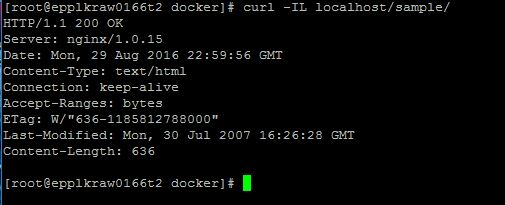

MTN.*NIX.11 Automated Environment Configuration Management
---

***Student***: [Aliaksei Khurhin](https://epa.ms/1Cqi0K)

Home Task
---

Using base docker image ***sbeliakou/centos:6.7***

1. Wiht ```Dockerfiles```:
    - Create Docker Image of ```nginx``` ([web.Dockerfile](/web.Dockerfile))
    - Create Docker Image of ```Tomcat 7``` ([tomcat.Dockerfile](/tomcat.Dockerfile))
    - Create Docker Image (Data Volume) with [```hello world```](https://tomcat.apache.org/tomcat-7.0-doc/appdev/sample/sample.war) application for Tomcat ([application.Dockerfile](application.Dockerfile))
    - Run these Images so that [http://localhost/sample](#screens) shows ```hello world``` page
    - ```Nginx``` container forwards http requests to ```Tomcat``` container; Only ```nginx``` container exposes port (80)
2. With ```docker-compose```:
    - Create [```docker-compose.yml```](/docker-compose.yml) file to build containers from previos task
    - Run "environment" in daemon mode
3. Create own branch (epam login without @epam.com, in lowercase)
4. Create PR with description of reported task
5. All needed changes (additional configuration/installations) on "Host" must be added into [Vagrantfile](/Vagrantfile)
6. All needed resources (if they are) must be placed into [```/resources```](/resources) folder

Task Report Notes
---
Vagrantfile includes pip and docker-compose installation.

docker compose runs through 'docker-compose up -d' command.
Only nginx container has exposed 80 port.

<a id="screens"></a>
- ```Curl from vagrant VM```:

- ```Browser access from host system```:

